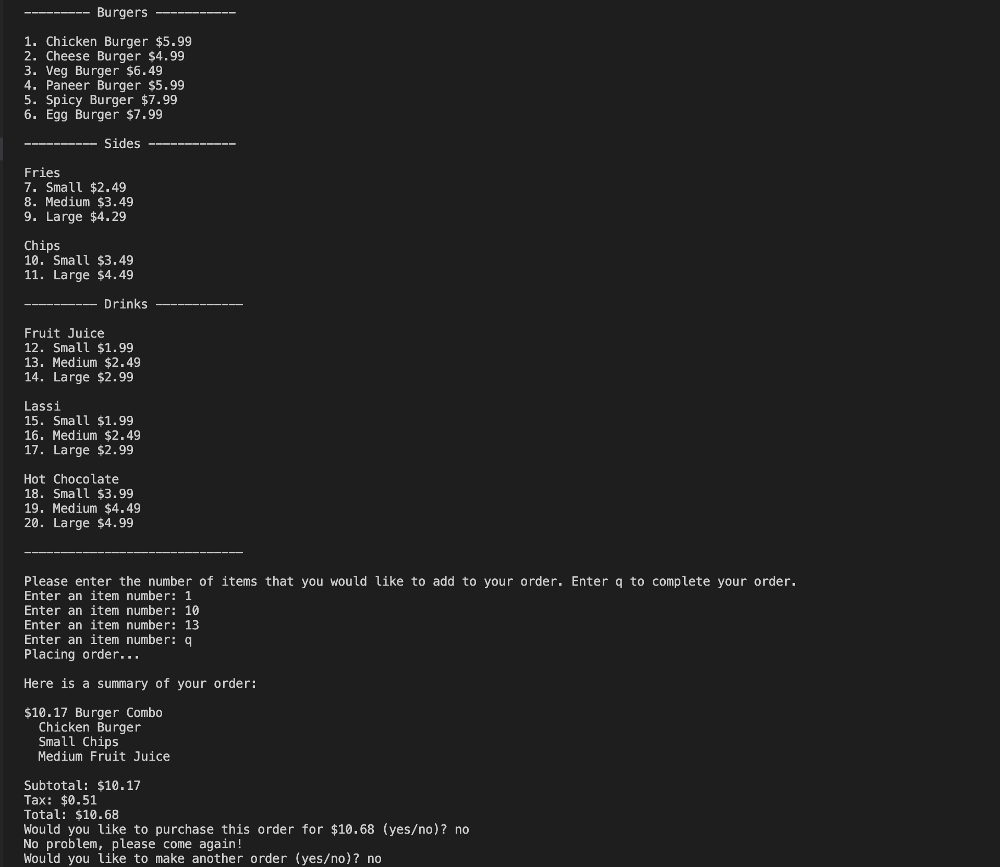

# Asynchronous Point Of Sale System

An asynchronous point of sale system for restaurants using Python is a software application that enables the management of orders and transactions in a restaurant environment. It utilizes the power of Python's asyncio library to handle multiple customer requests concurrently and in an efficient manner, providing a seamless and fast user experience.

